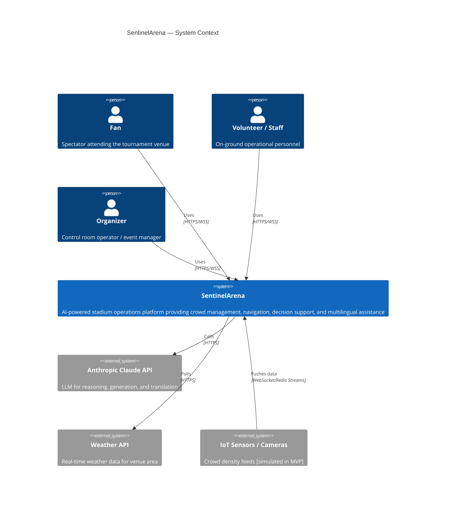
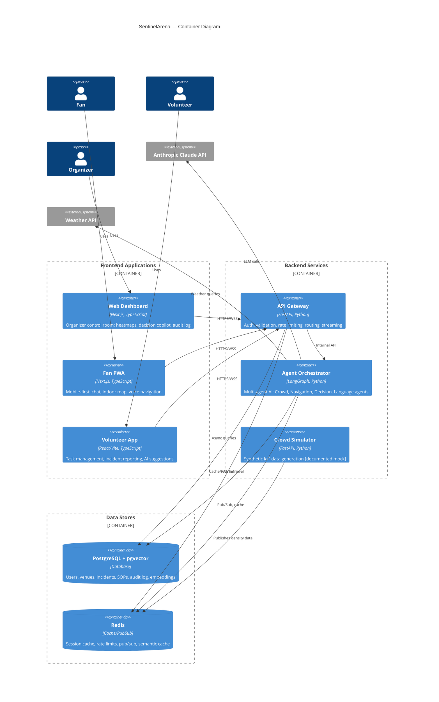
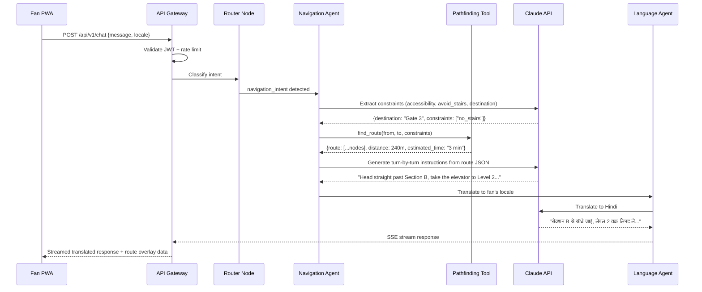
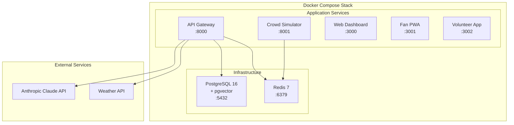

# SentinelArena — Architecture Document

> **Version:** 1.0 | **Last Updated:** 2025-01-15 | **Status:** Living Document

## 1. Context Diagram (C4 Level 1)

The system sits at the intersection of fans, volunteers, organizers, and external services:

## 2. Container Diagram (C4 Level 2)

## 3. Component Diagram — Agent Orchestrator (C4 Level 3)

```mermaid
flowchart TB
    subgraph Orchestrator ["Agent Orchestrator (LangGraph)"]
        Router["Router Node<br/>Intent Classification"]
        CrowdAgent["Crowd Agent<br/>Density Analysis + LLM Risk Assessment"]
        NavAgent["Navigation Agent<br/>NL → Pathfinding → NL Response"]
        DecisionAgent["Decision Agent<br/>Multi-source Fusion + Cited Recommendations"]
        LangAgent["Language Agent<br/>Locale-aware Translation + Tone"]
    end

    subgraph Tools ["Scoped Tools (Allow-listed)"]
        PathTool["Pathfinding Tool<br/>Dijkstra/A* on venue graph"]
        DensityTool["Density Query Tool<br/>Current + historical readings"]
        SOPTool["SOP Search Tool<br/>RAG over pgvector"]
        WeatherTool["Weather Tool<br/>Current conditions"]
    end

    subgraph Ports ["Ports (Interfaces)"]
        LLMPort["LLM Provider Port"]
        VectorPort["Vector Store Port"]
        WeatherPort["Weather Provider Port"]
        CrowdPort["Crowd Data Source Port"]
    end

    subgraph Adapters ["Adapters (Implementations)"]
        ClaudeAdapter["Anthropic Claude Adapter"]
        MockLLM["Mock LLM Adapter"]
        PGVectorAdapter["pgvector Adapter"]
        MockWeather["Mock Weather Adapter"]
        RedisCrowd["Redis Crowd Source"]
    end

    Router --> CrowdAgent
    Router --> NavAgent
    Router --> DecisionAgent
    CrowdAgent --> LangAgent
    NavAgent --> LangAgent
    DecisionAgent --> LangAgent

    NavAgent --> PathTool
    CrowdAgent --> DensityTool
    DecisionAgent --> SOPTool
    DecisionAgent --> WeatherTool
    DecisionAgent --> DensityTool

    LLMPort -.-> ClaudeAdapter
    LLMPort -.-> MockLLM
    VectorPort -.-> PGVectorAdapter
    WeatherPort -.-> MockWeather
    CrowdPort -.-> RedisCrowd
```

## 4. Data Flow — Fan Navigation Query

## 5. Security Architecture

```mermaid
flowchart LR
    subgraph External ["External Boundary"]
        Client["Client Apps"]
    end

    subgraph Gateway ["API Gateway"]
        CORS["CORS Filter"]
        Headers["Security Headers<br/>HSTS, CSP, X-Frame"]
        Auth["JWT Auth<br/>Short-lived access tokens"]
        RBAC["RBAC Middleware<br/>Role-based route guards"]
        Validate["Input Validation<br/>Pydantic v2 schemas"]
        RateLimit["Rate Limiter<br/>Token bucket via Redis"]
    end

    subgraph AI ["AI Layer"]
        PromptFence["Prompt Injection Defense<br/>Delimiter fencing"]
        ToolAllow["Tool Allow-listing<br/>4 scoped tools only"]
        OutputSanitize["Output Sanitization<br/>HTML/XSS filtering"]
        PIIRedact["PII Redaction<br/>Log sanitization"]
    end

    subgraph Data ["Data Layer"]
        Argon["Argon2id Hashing"]
        Parameterized["Parameterized Queries<br/>SQLAlchemy ORM"]
        AuditLog["Immutable Audit Log"]
    end

    Client --> CORS --> Headers --> Auth --> RBAC --> Validate --> RateLimit
    RateLimit --> PromptFence --> ToolAllow --> OutputSanitize --> PIIRedact
    PIIRedact --> Argon
    PIIRedact --> Parameterized
    PIIRedact --> AuditLog
```

## 6. Deployment Architecture

## 7. Key Design Decisions

See the [ADR/](./ADR/) folder for detailed Architecture Decision Records:

| ADR | Decision | Rationale |
|-----|----------|-----------|
| [ADR-001](./ADR/001-langgraph-over-raw-function-calling.md) | LangGraph over raw function calling | Structured multi-agent orchestration with state management |
| [ADR-002](./ADR/002-postgres-pgvector-over-dedicated-vector-db.md) | Postgres+pgvector over dedicated vector DB | Single data store, simpler ops, sufficient for venue-scale data |
| [ADR-003](./ADR/003-fastapi-unified-gateway.md) | Unified FastAPI gateway | Consistent async Python stack, shared auth/middleware |
| [ADR-004](./ADR/004-mock-adapter-pattern.md) | Mock adapter pattern for external APIs | Clean testing, zero-config dev, swappable in production |
| [ADR-005](./ADR/005-dual-model-strategy.md) | Dual-model cost strategy | Fast model for routing, reasoning model for synthesis |
